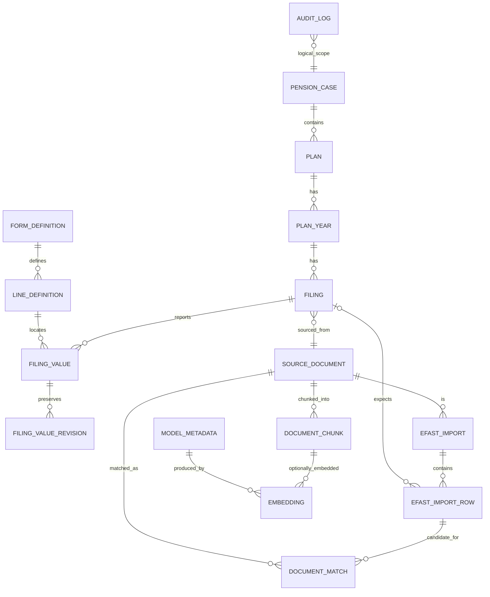

# ER diagram

```mermaid
erDiagram
  PENSION_CASE ||--o{ PLAN : contains
  PLAN ||--o{ PLAN_YEAR : has
  PLAN_YEAR ||--o{ FILING : has
  FILING }o--|| SOURCE_DOCUMENT : sourced_from
  FORM_DEFINITION ||--o{ LINE_DEFINITION : defines
  FILING ||--o{ FILING_VALUE : reports
  LINE_DEFINITION ||--o{ FILING_VALUE : locates
  FILING_VALUE ||--o{ FILING_VALUE_REVISION : preserves
  SOURCE_DOCUMENT ||--o{ EFAST_IMPORT : is
  EFAST_IMPORT ||--o{ EFAST_IMPORT_ROW : contains
  EFAST_IMPORT_ROW }o--o| FILING : expects
  EFAST_IMPORT_ROW ||--o{ DOCUMENT_MATCH : candidate_for
  SOURCE_DOCUMENT ||--o{ DOCUMENT_MATCH : matched_as
  SOURCE_DOCUMENT ||--o{ DOCUMENT_CHUNK : chunked_into
  DOCUMENT_CHUNK ||--o{ EMBEDDING : optionally_embedded
  MODEL_METADATA ||--o{ EMBEDDING : produced_by
  AUDIT_LOG }o--|| PENSION_CASE : logical_scope
```

The `AUDIT_LOG` relationship is logical rather than a foreign key because it records actions for multiple entity types via `(entity_type, entity_id)`.
